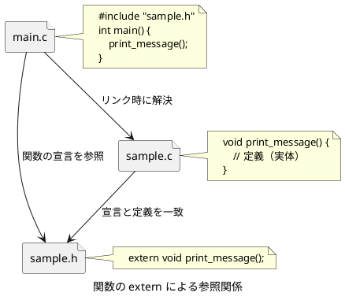
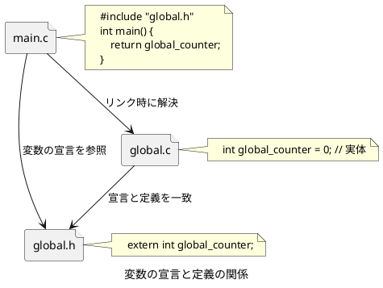
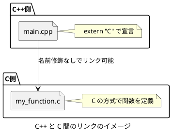
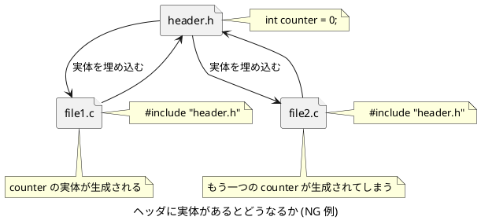
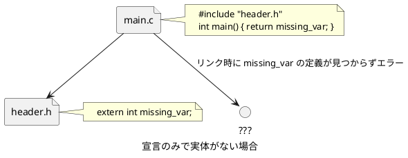
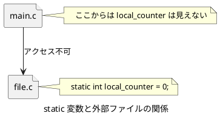
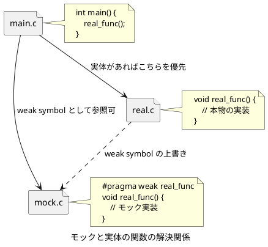

# C言語における `extern` と実体の理解

## `extern` とは何か？

`extern` は **外部に定義された関数や変数の参照を宣言するキーワード** である。  
主に複数ファイルにまたがって関数や変数を共有する際に使用される。

## 関数と変数における `extern` の違いと使い方

### 関数の `extern`

- C 言語では、関数は **暗黙的に `extern` 扱い** になる。
- ただし、**可読性や意図の明示の観点から `extern` を明示することが推奨される**。

```c
// sample.h
extern void print_message(void); // extern を明示すると意図が伝わる
```

```c
// sample.c
#include "sample.h"
void print_message(void) {
    printf("Hello, World!\n");
}
```



### 変数の `extern`

- **変数は `extern` を明示しなければ外部から参照できない**。
- 実体 (メモリの確保) は **1 か所のソースファイル** にだけ必要である。

```c
// global.h
extern int global_counter;
```

```c
// global.c
int global_counter = 0;
```



## C++ との相互運用 (`extern "C"`)

C++ では関数名に名前修飾が行われるため、C 関数を直接リンクできない。

### 解決策: `extern "C"` を使う

```cpp
// sample.h
#ifdef __cplusplus
extern "C" {
#endif

extern void my_function(void);

#ifdef __cplusplus
}
#endif
```



## なぜヘッダファイルに実体を定義してはいけないのか?

### 理由: **複数の実体が生成される**

```c
// NG: header.h
int counter = 0; // 実体を定義してしまっている
```

これを複数ファイルで include すると、リンク時にエラーが発生する:

```
multiple definition of `counter`
```



## `extern` があっても実体がない場合は?

- コンパイルは通るが **リンク時に未定義シンボルエラー** になる。

```c
// header.h
extern int missing_var;
```

```c
// main.c
#include "header.h"
int main() {
    return missing_var; // リンクエラー
}
```



## `extern` がない変数や関数はファイル内に閉じる

- **`static` を使うことで、外部に公開しないローカルなシンボルとして定義可能である**。

```c
// file.c
static int local_counter = 0; // 他ファイルからアクセス不可
```



## 関数の重複

C 言語では **関数の定義は重複できない**。複数の `.o` ファイルに同じシンボル (関数名) があると、リンク時にエラーになる。

しかし、**テストやモックライブラリの構成時に例外的に許される手法がある**。

### モック関数と `#pragma weak`

テスト用に本物の関数の代わりに **モック関数を使いたい場合**、`#pragma weak` を使うことで、**モック関数を「弱い定義 (weak symbol)」として登録** し、リンク時に本物の関数があればそちらを優先させることができる。

```c
// mock.c（モック側）
#include <stdio.h>

#pragma weak real_func

void real_func() {
    printf("This is a mock!\n");
}
```

```c
// real.c（本物の実装）
#include <stdio.h>

void real_func() {
    printf("This is the real one!\n");
}
```



### 実行時の振る舞い

| リンク対象                  | 実行結果                             |
|-----------------------------|--------------------------------------|
| `main.o + mock.o`           | "This is a mock!" が表示される       |
| `main.o + mock.o + real.o`  | "This is the real one!" が表示される |

### 注意点

- `#pragma weak` は **GCCなどの一部コンパイラに依存** する。
- 本番コードでは使用を避け、**主にユニットテストのための手法** として理解する。

## まとめ

| 項目                     | 説明                                       |
|--------------------------|--------------------------------------------|
| `extern`                 | 外部の定義を参照するキーワード             |
| 関数の宣言               | `extern` を省略可だが、可読性から明示推奨  |
| 実体 (定義)              | メモリを確保する唯一の場所                 |
| ヘッダでの実体定義       | 複数ファイルで include されると危険        |
| C++ 相互運用             | `extern "C"` でCの名前修飾を防止           |
| `static`                 | ファイル内限定のシンボル                   |
| 関数の重複定義           | 原則禁止だが `#pragma weak` で差し替え可能 |
| weak symbol のリンク順   | 実体が存在すればそちらが優先される         |
